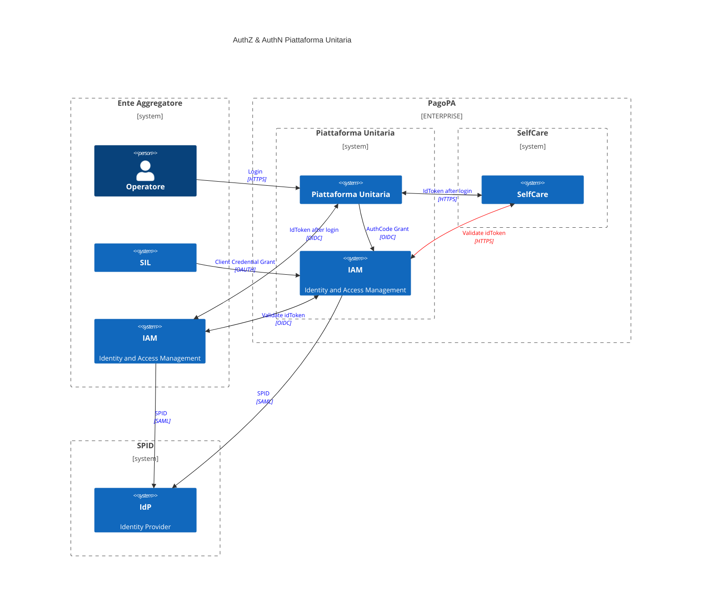

```mermaid
C4Context
title AuthZ & AuthN Piattaforma Unitaria

UpdateLayoutConfig($c4ShapeInRow="1", $c4BoundaryInRow="2")

Boundary(regione, "Ente Aggregatore") {
    Person(ea_op, "Operatore")
    System(ea_sil, "SIL")
    System(ea_iam, "IAM", "Identity and Access Management")
}

Enterprise_Boundary(repo, "PagoPA") {
    Boundary(pu, "Piattaforma Unitaria") {
        System(pu_app, "Piattaforma Unitaria")
        System(pu_iam, "IAM", "Identity and Access Management")
    }
    Boundary(selfcare, "SelfCare") {
        System(sc, "SelfCare")
    }
}

Boundary(spid, "SPID") {
    System(spid_idp, "IdP", "Identity Provider")
}

Rel(ea_op, pu_app, "Login", "HTTPS")
UpdateRelStyle(ea_op, pu_app, $textColor="blue", $lineColor="black", $offsetX="0", $offsetY="-30")

BiRel(pu_app, ea_iam, "IdToken after login", "OIDC")
UpdateRelStyle(pu_app, ea_iam, $textColor="blue", $lineColor="black", $offsetX="50", $offsetY="-70")

BiRel(pu_app, sc, "IdToken after login", "HTTPS")
UpdateRelStyle(pu_app, sc, $textColor="blue", $lineColor="black", $offsetX="-40", $offsetY="-10")

Rel(pu_app, pu_iam, "TokenExchange", "OAUTH")
UpdateRelStyle(pu_app, pu_iam, $textColor="blue", $lineColor="black", $offsetX="-20", $offsetY="00")

Rel(pu_app, pu_iam, "AuthCode Grant", "OIDC")
UpdateRelStyle(pu_app, pu_iam, $textColor="blue", $lineColor="black", $offsetX="00", $offsetY="00")

Rel(pu_iam, spid_idp, "SPID", "SAML")
UpdateRelStyle(pu_iam, spid_idp, $textColor="blue", $lineColor="black", $offsetX="00", $offsetY="00")

Rel(ea_iam, spid_idp, "SPID", "SAML")
UpdateRelStyle(ea_iam, spid_idp, $textColor="blue", $lineColor="black", $offsetX="00", $offsetY="-30")

Rel(ea_sil, pu_iam, "Client Credential Grant", "OAUTH")
UpdateRelStyle(ea_sil, pu_iam, $textColor="blue", $lineColor="black", $offsetX="-70", $offsetY="-20")

BiRel(pu_iam, sc, "Validate idToken", "HTTPS")
UpdateRelStyle(pu_iam, sc, $textColor="red", $lineColor="red", $offsetX="0", $offsetY="0")

BiRel(pu_iam, ea_iam, "Validate idToken", "OIDC")
UpdateRelStyle(pu_iam, ea_iam, $textColor="blue", $lineColor="black", $offsetX="0", $offsetY="0")
```
